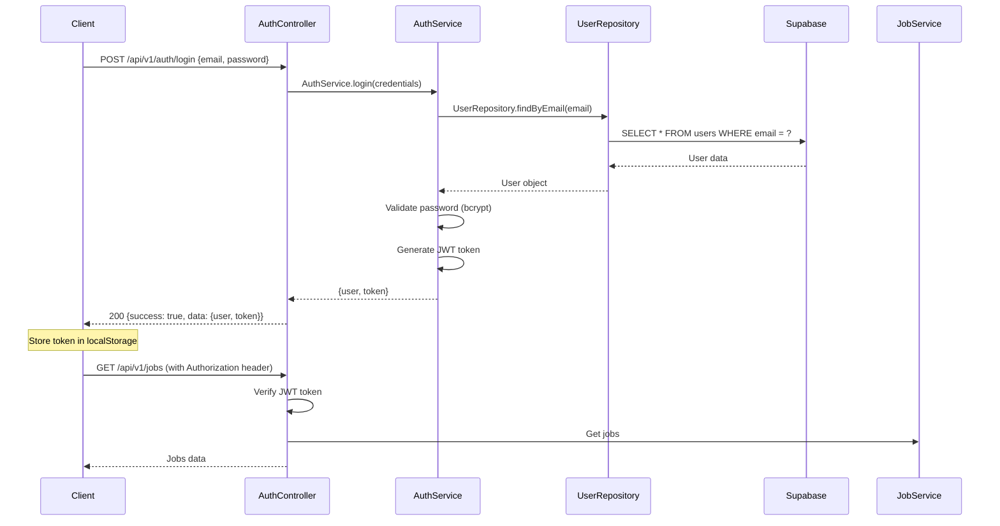
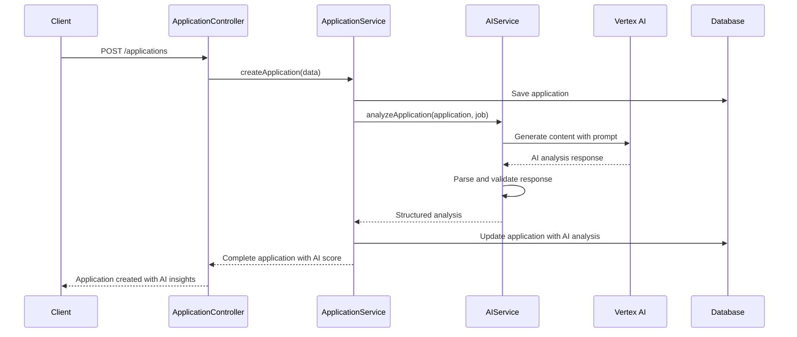

# Job Board Backend API

A comprehensive job board application backend built with Node.js, Express, TypeScript, and Supabase. Features AI-powered candidate matching, JWT authentication, and role-based access control.

## 🚀 Quick Start

### Prerequisites
- Node.js 18+ and npm
- Supabase account and project
- Google Cloud account (for AI features)

### Installation

```bash
# Clone and install dependencies
git clone https://github.com/shubham62462/jobboard-backend.git
npm install

# Environment setup
cp .env.example .env
# Configure your .env file (see Environment Variables section)

# Database setup
# Run the SQL schema in Supabase Dashboard (see Database Setup section)

# Start development server
npm run dev
```

### Test Account Credentials

```bash
# Employer Account
Email: employer3@test.com
Password: password

# Candidate Account  
Email: candidate3@test.com
Password: password

```

## 🏗️ Architecture Overview

### System Architecture

```
Client (Frontend) → Express API → Services → Repositories → Supabase Database
                                     ↓
                              Google Vertex AI
```

### Directory Structure

```
backend/
├── src/
│   ├── config/          # Configuration files
│   │   ├── database.ts  # Supabase client setup
│   │   └── env.ts       # Environment variables validation
│   ├── controllers/     # HTTP request handlers
│   │   ├── AuthController.ts
│   │   ├── JobController.ts
│   │   ├── ApplicationController.ts
│   │   └── UserController.ts
│   ├── services/        # Business logic layer
│   │   ├── AuthService.ts
│   │   ├── JobService.ts
│   │   ├── ApplicationService.ts
│   │   └── AIService.ts
│   ├── repositories/    # Data access layer
│   │   ├── UserRepository.ts
│   │   ├── JobRepository.ts
│   │   └── ApplicationRepository.ts
│   ├── middlewares/     # Express middlewares
│   │   ├── auth.ts      # JWT authentication/ Role Handling
│   │   ├── errorHandler.ts
│   ├── types/           # TypeScript type definitions
│   │   └── index.ts
│   └── routes/          # API route definitions
│       ├── auth.ts
│       ├── jobs.ts
│       ├── applications.ts
│       └── users.ts
├── package.json
├── tsconfig.json
└── README.md
```

### Authentication Flow



## 🗄️ Database Schema

### Core Tables

#### Users Table (Combined User + Profile)
```sql
CREATE TABLE public.users (
  id UUID PRIMARY KEY DEFAULT uuid_generate_v4(),
  email VARCHAR(255) UNIQUE NOT NULL,
  password VARCHAR(255) NOT NULL,  -- bcrypt hashed
  role VARCHAR(20) NOT NULL CHECK (role IN ('employer', 'candidate')),
  
  -- Profile information
  first_name VARCHAR(100) NOT NULL,
  last_name VARCHAR(100) NOT NULL,
  phone VARCHAR(20),
  bio TEXT,
  skills TEXT[],  -- Array of skills
  experience TEXT,
  education TEXT,
  resume_url TEXT,
  
  created_at TIMESTAMP WITH TIME ZONE DEFAULT NOW(),
  updated_at TIMESTAMP WITH TIME ZONE DEFAULT NOW()
);
```

#### Jobs Table
```sql
CREATE TABLE public.jobs (
  id UUID PRIMARY KEY DEFAULT uuid_generate_v4(),
  title VARCHAR(255) NOT NULL,
  description TEXT NOT NULL,
  requirements TEXT NOT NULL,
  location VARCHAR(255) NOT NULL,
  salary VARCHAR(100),
  employer_id UUID NOT NULL,
  status VARCHAR(20) NOT NULL DEFAULT 'active',
  
  created_at TIMESTAMP WITH TIME ZONE DEFAULT NOW(),
  updated_at TIMESTAMP WITH TIME ZONE DEFAULT NOW(),
  
  CONSTRAINT fk_jobs_employer_id FOREIGN KEY (employer_id) REFERENCES public.users(id)
);
```

#### Applications Table
```sql
CREATE TABLE public.applications (
  id UUID PRIMARY KEY DEFAULT uuid_generate_v4(),
  job_id UUID NOT NULL,
  candidate_id UUID NOT NULL,
  resume TEXT NOT NULL,
  cover_letter TEXT,
  status VARCHAR(20) NOT NULL DEFAULT 'pending',
  ai_score INTEGER CHECK (ai_score >= 0 AND ai_score <= 100),
  ai_analysis JSONB,  -- AI analysis results
  
  created_at TIMESTAMP WITH TIME ZONE DEFAULT NOW(),
  updated_at TIMESTAMP WITH TIME ZONE DEFAULT NOW(),
  
  CONSTRAINT fk_applications_job_id FOREIGN KEY (job_id) REFERENCES public.jobs(id),
  CONSTRAINT fk_applications_candidate_id FOREIGN KEY (candidate_id) REFERENCES public.users(id),
  CONSTRAINT applications_unique_job_candidate UNIQUE(job_id, candidate_id)
);
```

### Database Relationships

```
users (1) ──────────── (*) jobs
  │                        │
  │                        │
  └────── (*) applications (*)
```

### Indexes for Performance

```sql
-- Users indexes
CREATE INDEX idx_users_email ON public.users(email);
CREATE INDEX idx_users_role ON public.users(role);

-- Jobs indexes
CREATE INDEX idx_jobs_employer_id ON public.jobs(employer_id);
CREATE INDEX idx_jobs_status ON public.jobs(status);
CREATE INDEX idx_jobs_title_search ON public.jobs USING gin(to_tsvector('english', title));

-- Applications indexes
CREATE INDEX idx_applications_job_id ON public.applications(job_id);
CREATE INDEX idx_applications_candidate_id ON public.applications(candidate_id);
CREATE INDEX idx_applications_ai_score ON public.applications(ai_score DESC NULLS LAST);
```

## 🤖 AI Integration Approach

### AI Service Architecture

```typescript
// src/services/AIService.ts
export class AIService {
  private vertexAI: VertexAI;
  
  async analyzeApplication(application: Application, job: Job): Promise<AIAnalysis> {
    const prompt = this.buildAnalysisPrompt(application, job);
    const response = await this.vertexAI.generateContent(prompt);
    return this.parseAIResponse(response);
  }
}
```

### Prompt Design Strategy

#### Application Analysis Prompt
```typescript
const buildAnalysisPrompt = (application: Application, job: Job) => `
Analyze the following candidate resume against the job requirements:

JOB DETAILS:
Title: ${job.title}
Requirements: ${job.requirements}
Description: ${job.description}

CANDIDATE APPLICATION:
Resume: ${application.resume}
Cover Letter: ${application.cover_letter || 'Not provided'}

Please provide:
1. Overall match score (0-100)
2. Key strengths
3. Areas of concern
4. Detailed explanation
5. Recommendation

Format as JSON with fields: score, strengths[], concerns[], explanation, recommendation

Be objective, professional, and focus on job-relevant qualifications.
`;
```

### AI Analysis Workflow



### AI Error Handling

```typescript
async analyzeApplication(application: Application, job: Job): Promise<AIAnalysis | null> {
  try {
    // AI analysis logic
    return analysis;
  } catch (error) {
    console.error('AI Analysis failed:', error);
    // Return null - application still succeeds without AI
    return null;
  }
}
```

## 🔒 Security Considerations

### Authentication & Authorization

#### JWT Token Security
```typescript
// JWT configuration
const jwtConfig = {
  secret: process.env.JWT_SECRET, // 256-bit secret
  expiresIn: '7d',
  issuer: 'job-board-api',
  audience: 'job-board-client'
};

// Token verification middleware
export const authenticateToken = (req: AuthenticatedRequest, res: Response, next: NextFunction) => {
  const authHeader = req.headers.authorization;
  const token = authHeader && authHeader.split(' ')[1];
  
  if (!token) {
    return res.status(401).json({ error: 'Access token required' });
  }
  
  jwt.verify(token, config.JWT_SECRET, (err, decoded) => {
    if (err) return res.status(403).json({ error: 'Invalid or expired token' });
    req.user = decoded as JwtPayload;
    next();
  });
};
```

#### Role-Based Access Control
```typescript
export const requireRole = (role: 'employer' | 'candidate') => {
  return (req: AuthenticatedRequest, res: Response, next: NextFunction) => {
    if (req.user?.role !== role) {
      return res.status(403).json({ error: 'Insufficient permissions' });
    }
    next();
  };
};
```

### Row Level Security (RLS) Implementation

#### RLS Policies Overview
```sql
-- Enable RLS on all tables
ALTER TABLE public.users ENABLE ROW LEVEL SECURITY;
ALTER TABLE public.jobs ENABLE ROW LEVEL SECURITY;
ALTER TABLE public.applications ENABLE ROW LEVEL SECURITY;
```

#### Service Key Access (Backend)
```sql
-- Backend service has full access (bypasses RLS)
CREATE POLICY "service_role_full_access" ON public.users
  FOR ALL TO service_role
  USING (true) WITH CHECK (true);
```

#### Direct Access Restrictions (Additional Security Layer)
```sql
-- Users table: Public info readable, no direct writes
CREATE POLICY "users_public_read" ON public.users
  FOR SELECT TO authenticated
  USING (true);

CREATE POLICY "users_no_direct_write" ON public.users
  FOR INSERT TO authenticated
  WITH CHECK (false);

-- Jobs table: Active jobs readable, no direct writes  
CREATE POLICY "jobs_public_read_active" ON public.jobs
  FOR SELECT TO authenticated
  USING (status = 'active');

-- Applications table: No direct access (sensitive data)
CREATE POLICY "applications_no_direct_access" ON public.applications
  FOR ALL TO authenticated
  USING (false);
```

### Input Validation & Sanitization

#### SQL Injection Prevention
- **Parameterized queries** via Supabase client
- **Type safety** with TypeScript

### CORS Configuration
```typescript
this.app.use(cors({
    origin: config.ALLOWED_ORIGINS,
    credentials: true,
    methods: ['GET', 'POST', 'PUT', 'DELETE', 'PATCH', 'OPTIONS'],
    allowedHeaders: ['Content-Type', 'Authorization']
}));
```

### Environment Variables

```env
# Database
SUPABASE_URL=your_supabase_project_url
SUPABASE_SERVICE_ROLE_KEY=your_service_role_key
SUPABASE_ANON_KEY=anon_key

# Authentication
JWT_SECRET=your_256_bit_secret_key
JWT_EXPIRES_IN=7d

# AI Integration
GOOGLE_CLOUD_PROJECT_ID=your_project_id
GOOGLE_CLOUD_LOCATION=project_location
VERTEX_AI_MODEL=ai_model

# Server
PORT=5000
NODE_ENV=development

# CORS
FRONTEND_URL=http://localhost:3000
```

## 📡 API Endpoints

### Authentication
- `POST /api/v1/auth/register` - User registration
- `POST /api/v1/auth/login` - User login
- `GET /api/v1/auth/me` - Get current user
- `PUT /api/v1/auth/me` - Update user profile
- `POST /api/v1/auth/logout` - User logout

### Jobs
- `GET /api/v1/jobs` - Get all active jobs (paginated)
- `GET /api/v1/jobs/:id` - Get specific job
- `POST /api/v1/jobs` - Create job (employers only)
- `PUT /api/v1/jobs/:id` - Update job (owner only)
- `DELETE /api/v1/jobs/:id` - Delete job (owner only)
- `GET /api/v1/jobs/employer/my-jobs` - Get employer's jobs

### Applications
- `POST /api/v1/applications` - Submit application (candidates only)
- `GET /api/v1/applications/my-applications` - Get user's applications
- `GET /api/v1/applications/job/:jobId` - Get job applications (employer only)
- `GET /api/v1/applications/:id` - Get specific application
- `PUT /api/v1/applications/:id/status` - Update application status

## 🚀 Deployment

### Production Environment
```bash
# Build for production
npm run build

# Start production server
npm start
```

## 📈 Performance Considerations

- **Database indexing** on frequently queried columns
- **Connection pooling** via Supabase
- **Pagination** for large result sets  
- **Caching** strategies for static data
- **Rate limiting** for API endpoints
- **Compression** for API responses

## 🐛 Troubleshooting

### Common Issues

1. **Foreign Key Relationship Errors**
   ```sql
   -- Check constraint names
   SELECT constraint_name FROM information_schema.table_constraints 
   WHERE table_name = 'jobs' AND constraint_type = 'FOREIGN KEY';
   ```

2. **JWT Token Issues**
   - Ensure JWT_SECRET is properly configured
   - Check token expiration settings
   - Verify authorization header format

3. **AI Integration Failures**
   - Check Google Cloud credentials
   - Verify Vertex AI API is enabled
   - Monitor API quotas and limits

## 📞 Support

For issues and questions:
- Check the troubleshooting section
- Review API endpoint documentation
- Examine error logs in development console

---

**Built with ❤️ using Node.js, Express, TypeScript, and Supabase**